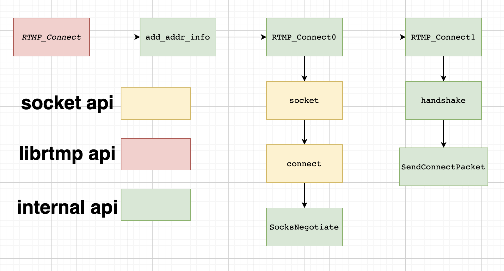

# rtmp
This file is mainly used for more fine-grained parsing of [rtmp file](../src/rtmpdump/librtmp/rtmp.c) methods.

## RTMP_Init

## RTMP_SetupURL
This function parse more than rtmp url. \
An example character string suitable for use with RTMP_SetupURL():
```
rtmp://flashserver:1935/ondemand/thefile swfUrl=http://flashserver/player.swf swfVfy=1
```

## RTMP_Connect
Flow Chart
1. add_addr_info: assign value to sockaddr_in from RTMP.Link,init a socket address;
2. RTMP_Connect0: init a socket, establish socket connection.Then do SocksNegotiate;
3. RTMP_Connect1: handshake, SendConnectPacket

The following are two more important functions in connect;

## handshake
For more specific handshake details, refer to the [handshake.h](../src/rtmpdump/librtmp/handshake.h) file.

RTMP Handshake Diagram:


## SendConnectPacket
If you want to understand the structure of the **RTMPPacket**, you can refer to the [RTMP Wiki](https://en.wikipedia.org/wiki/Real-Time_Messaging_Protocol#Connect) **PACKET STRUCTURE paragraph**. 
The Structure members explication in rtmp.h file.

## RTMP_SendPacket
Generate **chunk headers** and write chunk based on the packet type . \
You can learn about the type and structure of different headers in advance from wiki.It is worth noting here that the difference between basic header and message header.

## RTMP_ReadPacket

## RTMP_ClientPacket

## HandleInvoke

## RTMP_ConnectStream

## RTMP_Read
