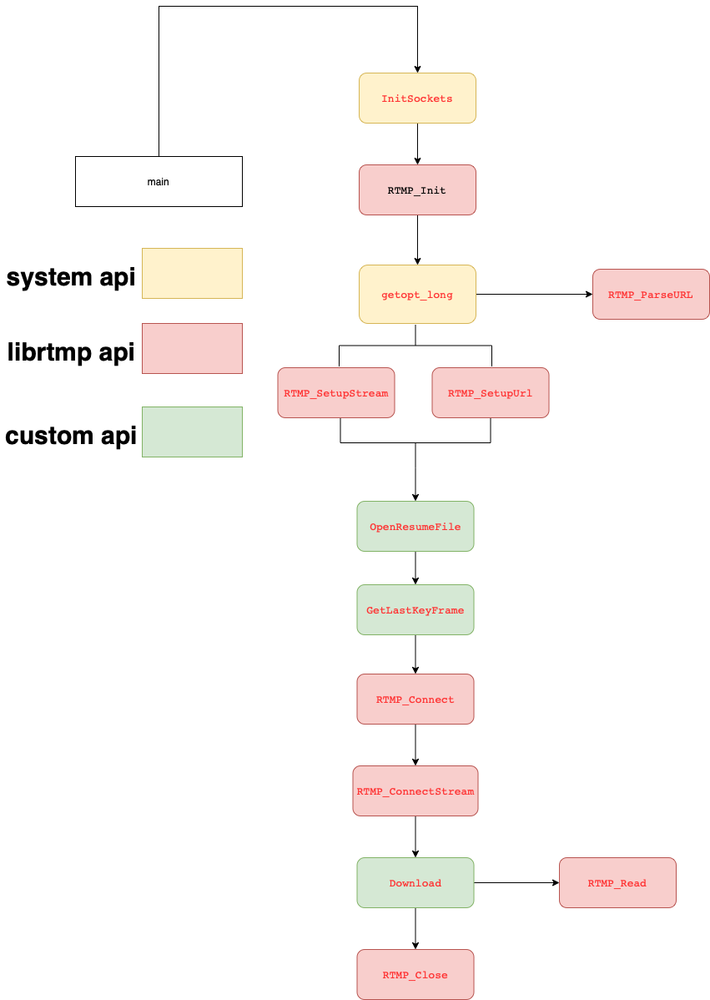

# rtmpdump explication

**Sourcecode** : [rtmpdump.c](/src/rtmpdump/rtmpdump.c)

Flowchart by **functions** : 

Rtmpdump is mainly divided into the following **parts**
1. Variables definition
2. Read parameters and assign to variables
3. Url parse
4. Resume file(optional)
5. RTMP Start
6. Data Download
7. RTMP Close

------------

## Variables definition
There are many variables in rtmpdump initialized at the beginning of the main function.\
In order to deeply understand the meaning of certain variables, you may read **usage** function additionally.

## Read parameters and assign to variables
Reading input parameters through **getopt_long** function.Among the more important is the reading of **rtmp url** by -r option.
When we receive the rtmp url then parse it.

## Url parse
The specific url parsing method is written in the [parsurl.c](../src/rtmpdump/librtmp/parseurl.c) file.\
Usually the rtmp format is like this: `rtmp[t][e|s]://hostname[:port][/app[/playpath]]`.  
Through string parsing of URL we can get _protocol, host, port, playpath and app_. 
These parsed parameters will be assigned to the link structure of RTMP through the **RTMP_SetupStream** method.\
It is worth noting that **RTMP_SetupURL** function covers parse url and setup stream.

## Resume file(optional)
The entire resume process includes OpenResumeFile and GetLastKeyFrame. 

### OpenResumeFile
### GetLastKeyFrame
Studying these two methods requires some understanding of the [flv file format](https://docs.fileformat.com/video/flv/). \
The analysis of flv here uses [AMF](../src/rtmpdump/librtmp/amf.c) decoding.\
The function(OpenResumeFile) parses the **script tag metadata** and **duration** of the file.\
For specific more, please refer to the **comments of the source code**.

## RTMP Start
 The variable first inside function leads to RTMP_Connect and RTMP_ConnectStream.
 Refer to [rtmp.md](../explication/rtmp.md) and [source file](../src/rtmpdump/librtmp/rtmp.c) for more. 

### RTMP_Connect
Establish a socket connect then send a connect-packet for confirming.

### RTMP Stream Connect
Read packet(RTMP_ReadPacket) until m_bPlaying == TRUE indicates that the stream has completed the connection.\
The more important functions here are **RTMP_ReadPacket** and **RTMP_ClientPacket**(processing).\
RTMP_ClientPacket does different processing according to the message type, what needs to be processed here is the **RTMP_PACKET_TYPE_INVOKE** message._Then jump to the **HandleInvoke** function._\
HandleInvoke is used to handle messages of type invoke. _What needs to be processed here is **av_createStream**._

## Download

